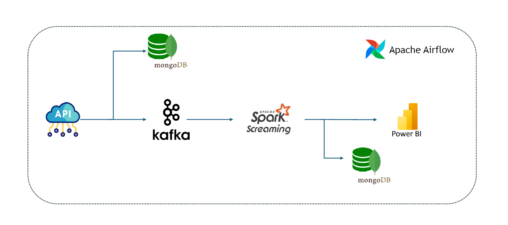
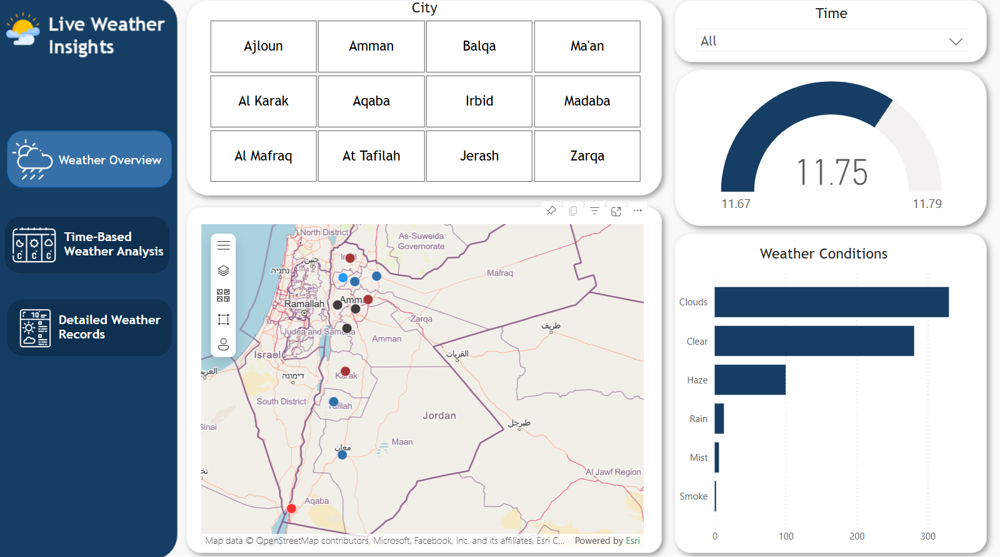
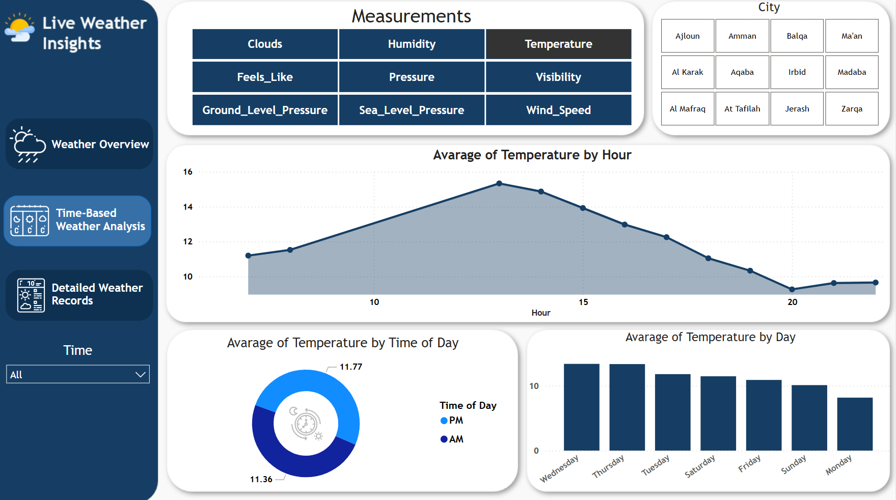
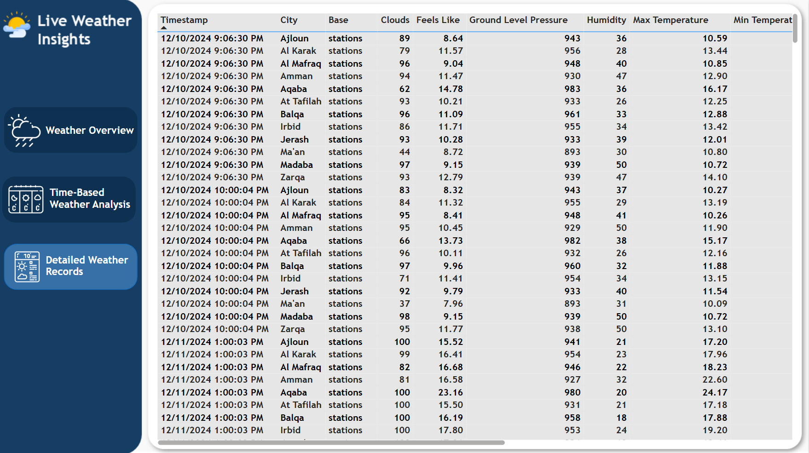

# Real-Time-Weather-Data-Pipeline
This project demonstrates the implementation of a real-time weather data processing pipeline. 
The pipeline leverages OpenWeather API for hourly data collection, Kafka for real-time data ingestion, Spark Streaming for data transformation, and MongoDB for storing both raw and processed data. The pipeline is designed to provide timely insights into weather patterns through a dashboard updated daily.

And this is the workflow for this project

Here’s a breakdown of your project in steps, similar to the style you provided:

1. Data Generation and Ingestion

   Data Generation:

      Weather data is fetched for various cities using the OpenWeatherMap API.
      Each data fetch provides information like temperature, humidity, wind speed, and more, along with a timestamp.

   Kafka:
   
      The generated weather data is sent to a Kafka topic (Weather-pipeline) for real-time ingestion.
      Kafka ensures fault-tolerant and scalable data streaming.

2. Data Storage
   
   MongoDB:
   
      The raw weather data fetched from the API is stored in a MongoDB collection named weather_row_data.
      This ensures that all incoming data is persisted for further processing.

3. Real-Time Data Processing with Spark
   
   Apache Spark Streaming:
   
      Spark reads data from the Kafka topic Weather-pipeline.
      The incoming JSON data is parsed and transformed using the following steps:
              Schema Definition: Define a structured schema for weather data, including fields like temperature, pressure, wind speed, and city.
              Transformation: Convert temperatures from Kelvin to Celsius, map city names to corrected names, and standardize data.
   
   Processed Data Storage:
   
      The transformed data is stored back in MongoDB in the weather_processed_data collection.

4. Data Modeling
   
      The processed data is organized for analysis, ensuring fields like weather conditions, timestamps, and city-specific information are easily accessible.
      This enables integration with visualization and reporting tools for further insights.

5. Airflow for Pipeline Orchestration
   
      The entire workflow is orchestrated using Apache Airflow.
      Tasks are defined in a DAG (Data_Pipeline), including:

      Fetching raw data.
      Sending data to Kafka.
      Processing and storing data.

      The pipeline is scheduled to run hourly.

6. Real-Time Reporting and Visualization
    
   Dashboards:

      Real-time dashboards are created using visualization tools (e.g., Power BI or similar tools).

      Dashboards update hourly, providing insights into:

   Weather conditions across cities.
   Temperature trends.
   Wind speed and humidity variations.

   and these are pictures from the dashboard
   
   
   
